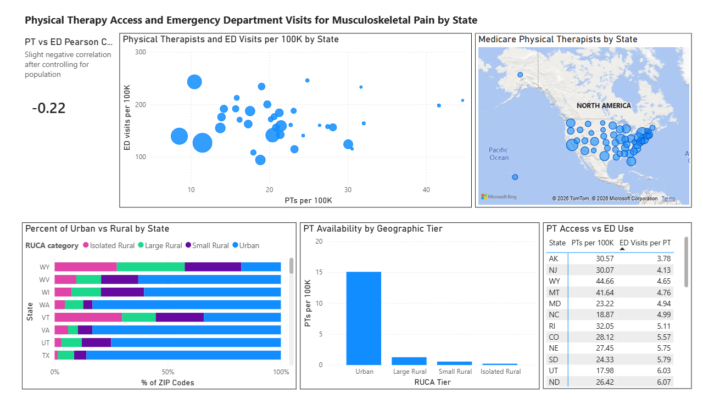

# Physical-Therapy-Access-and-Emergency-Department-Utilization-Analysis-
Analysis of how PT access might change ED utilization for MSK issues

## Project Overview
I designed this project to examine whether physical therapy availability is associated with emergency department utilization for musculoskeletal conditions. Using Medicare provider data from the Centers for Medicare & Medicaid Services (CMS), emergency department utilization data from the Agency for Healthcare Research and Quality (AHRQ), U.S. Census population data, and USDA Rural–Urban Commuting Area (RUCA) classifications, I analyzed geographic access to physical therapy and its relationship to emergency department visits for back and neck pain. 
## Business Problem
Many people seek healthcare for musculoskeletal (MSK) problems such as back and neck pain. For reasons including access to care, insurance, health literacy, and severity of symptoms, many people look for care for these issues at the emergency department (ED) rather than at an outpatient physical therapy (PT) clinic. Because ED visits tend to use more healthcare resources and be more expensive than PT visits, understanding whether geographic access to PT is associated with higher ED visits may help identify potential disparities in access and opportunities for easier access to care.
## Business Question
- How many physical therapists who participate in Medicare are in each state, city, and ZIP code?
- How do different levels of rurality affect availability of PT providers?
- Is greater access to physical therapy associated with fewer trips to the ED for MSK issues?
## Tools
BigQuery, SQL, Excel, Power BI
## Datasets
**1. CMS Medicare Physician & Other Practitioners (2024)** Centers for Medicare & Medicaid Services (CMS)  
This national dataset provided provider-level billing data, including billed service units, Medicare reimbursement amounts, provider credentials, specialty, and practice ZIP codes  
**2. Agency for Healthcare Research and Quality (AHRQ) – Emergency Department Visits**
This dataset provided state-level emergency department visit rates for back and neck pain. Because California was not included in the 2023 or 2024 releases, I used the 2022 dataset to preserve California in the analysis. The AHRQ dataset includes data for 37 states  
**3. U.S. Census Bureau – 2020 Census Apportionment Results**
This dataset provided state population counts used to calculate physical therapists per 100,000 population and to normalize comparisons across states  
**4. USDA Economic Research Service – RUCA Codes by ZIP Code (2020)**
This dataset provided Rural–Urban Commuting Area (RUCA) classifications for ZIP codes, allowing analysis of physical therapist distribution by geographic tier  

Variables included:
- Provider education level (Doctorate, Master's, Bachelor's)
- Number of Medicare physical therapists
- Physical therapists per 100,000 population
- Medicare billed service units
- Medicare reimbursement amount
- Emergency department visits for back and neck pain
- State population
- RUCA score
- Geographic tier (Urban, Small Rural, Large Rural, Isolated Rural)  

## Data Cleaning and Preparation
CMS dataset
- Filtered to providers with the specialty "Physical Therapist in an Outpatient Setting"
- Excluded pharmacological billing codes because physical therapists do not have prescribing authority
- Standardized more than 1,500 unique self-reported credential entries into three education categories (Doctorate, Master's, Bachelor's) using SQL regular expressions
- Restored leading zeros to ZIP codes using LPAD() to preserve geographic accuracy
  
AHRQ dataset
- Excluded military facilities, Guam, Puerto Rico, and the U.S. Virgin Islands to maintain consistency with the state-level analysis
  
RUCA dataset
- Removed RUCA score 99 entries representing ZIP codes with no resident population
- Standardized ZIP code formatting to support joins with CMS provider data
- Standardized RUCA ZIP codes, removed RUCA code 99 records, and joined ZIP-level RUCA classifications to the cleaned CMS provider dataset to support rurality analysis
  
## Methodology
- Examined whether states with greater PT availability demonstrated different patterns of ED utilization
- Determined number of PTs per state, city, and ZIP code
- Combined CMS and RUCA datasets to determine number of PTs per RUCA tier
- Calculated number of practicing PTs per 100K population to account for differences across state populations
- Reviewed number of practicing PTs across urban, large rural, small rural, and isolated rural areas
- Calculated the percentage of ZIP codes within each RUCA geographic tier by state
- Compared state-level visits to the ED for neck and back pain across states
- Analyzed whether number of PTs per geographic region is associated with numbers of ED visits for MSK pain

## Key Findings
- PT availability varied substantially by state even after accounting for differences in population size
- PTs are more common in urban areas compared to rural areas
- Analysis of PT locations by RUCA classification showed that urban ZIP codes generally contained more Medicare-participating physical therapists than large rural, small rural, or isolated rural ZIP codes
- The Pearson correlation coefficient between PTs per 100K and ED visits for MSK pain per 100K was -0.216, indicating a weak negative linear association. Within the states represented in all datasets, greater physical therapist availability was associated with slightly lower ED visit rates for MSK pain
  
## Power BI Dashboard

- Physical Therapists and ED Visits per 100K by State: allows comparison of PTs per 100K residents and ED visits per 100K residents with bubble size representing total state population
- Medicare Physical Therapists by State: drill down capabilities to examine differences in the number of Medicare participating PTs by state, city, and ZIP code
- Percent of Urban vs Rural by State: compares percentage of ZIP codes per RUCA tier by state spanning urban, large rural, small rural, and isolated rural to provide context for differences in rurality by state
- PT Availability by Geographic Tier: compares Medicare-billing physical therapist availability per 100K population across RUCA geographic tiers nationwide. PT availability was highest in urban areas and decreased substantially across large rural, small rural, and isolated rural areas
- PT Access vs ED Use: compares the number of PTs per 100K residents with ED visits per therapist by state, providing an additional view of PT availability and ED utilization
